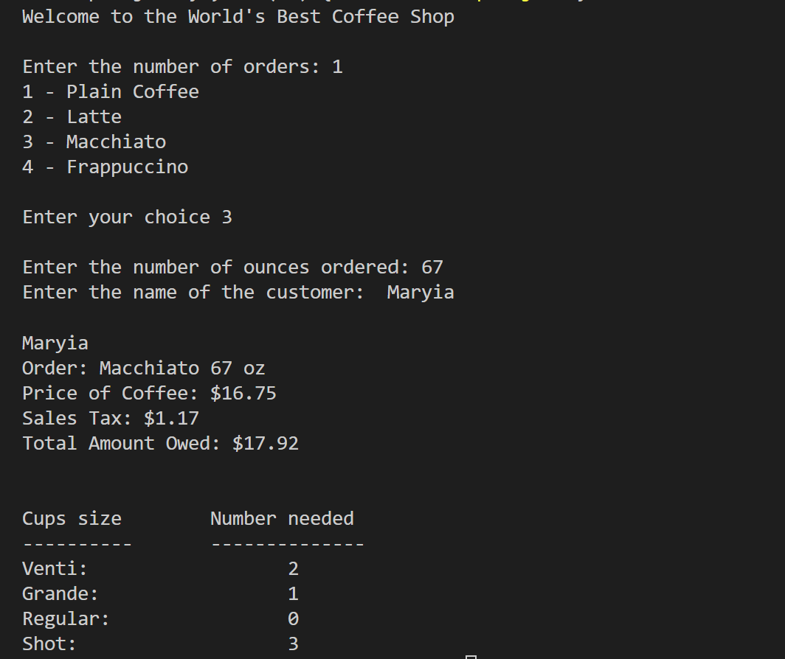

# Coffee-Shop Project
## malakhavam
   
## Description 
   
This training project calculates amount of the coffee owed and number of cups. Also it reads orders from the txt file if amount of orders is more that 3 and writes bill to the txt file.
   
## Table of Contents  
   * [Installation](#installation)
   * [Screenshot](#screenshot)
   * [Contributors](#contibutors) 
   * [License](#license)
   * [Questions](#questions)
   
   
## Installation 
   
   The project was uploaded to GitHub at the following repository: https://github.com/malakhavam/Coffee-Shop  
   To install the project follow these steps: 
   * Clone the application from GitHub with: git clone [clone link from GitHub] 
   * Open application in VS Code
   * Run the code in terminal

## Screenshot

## Contributors

   N/A

## License

   MIT
  
## Questions
   
   If you have questions or you want to share comments, we will be glad to hear from you. Please contact me at malakhava@yahoo.com

